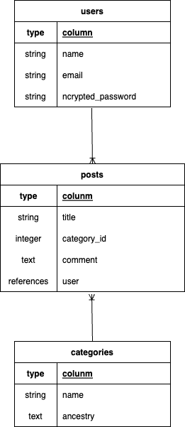
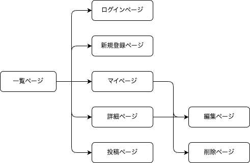

# アプリケーション名
cook-app

# アプリケーション概要
健康に気をつけていて、日々の食生活で病気の予防や健康的な体を維持したいと考えている人がどんな料理があるのかを見たり、投稿したりできる。

# URL
https://cook-app.onrender.com

# テスト用アカウント
- Basic認証ID：admin
- Basic認証パスワード： 2222
- メールアドレス： test@test.jp
- パスワード： test1111

# 利用方法
## ユーザー管理機能
１．トップページのヘッダーから「登録する」ボタンをクリックすると、新規登録画面へと遷移できる。ニックネームやメールアドレス、パスワードを入力し登録ボタンをクリックすると新規登録できる。
２．ログイン後、トップページであるマイページから、自分が投稿した内容を見て、編集、削除ができる
３．ヘッダーのログアウトボタンをクリックすると、アプリからログアウトできる。
４．ログインしていない場合に投稿内容へとアクセスすると、ログイン画面へと遷移する。メールアドレスとパスワードを入力するとログインすることができる。

## 投稿管理機能
１．ログイン後、「投稿する」から投稿画面に遷移する
２．投稿画面で「タイトル」「カテゴリー」「写真」「コメント」を入力して「投稿する」を押すとプレビュー表示後、トップページに遷移する
３．トップページで投稿写真を押すと詳細ページに遷移する
４．詳細ページでは編集、削除ができる

# アプリケーションを作成した背景
元々医療関係の勉強をしており、生活習慣病など身近な病気の予防法で薬以外で確実に影響を与えられるものは何かを考えていた時、食事は毎日摂るものなので食事療法を医療ではなくもっと身近で誰もができるものだと知ってもらい、日常の中に取り入れてもらおうと考えて投稿型のアプリケーションを作成しました。

# 洗い出した要件
要件定義シート
https://docs.google.com/spreadsheets/d/1fvHD1mPxZhUsRYl1Ptw_uKRVeV9GV7_AUkJ_xDOyocw/edit?usp=sharing

# 実装予定の機能
現在、JavaScriptやBootstrapを使用してアプリ全体を整えていく
その後
・リスト機能を使いカテゴリー別に閲覧する機能
・マイページからのユーザーの登録内容変更機能
・ログイン画面からのパスワード再設定機能
・コメント欄にサンプルを表示して内容を書きやすくする機能

# データベース設計
## Post テーブル

| column       | Type     |       Options     |
|--------------|----------|-------------------|
| title        | string   |                   |
| category_id  | integer  | null: false       |
| comment      | text     |                   |
| user_id      | integer  | null: false, foreign_key: true |

### Association

- belongs_to :user
- belongs_to_active_hash :category
- has_one_attached :image

## Users テーブル

| column             | Type     |       Options           |
|--------------------|----------|-------------------------|
| name               | string   | null: false             |
| email              | string   | null: false, DEFAULT '' |
| encrypted_password | string   | null: false, DEFAULT '' |

### Association

- has_many :posts

# 画面遷移図

# 開発環境
- フロントエンド
HTML、CSS
- バックエンド
Ruby on Rails、MySQL
- インフラ
Render、PostgreSQL
- テキストエディタ
Visual Studio Code

# 工夫したポイント
少しでも気軽に閲覧、投稿できるようにカード機能で１つ１つ画像付きで区切りながら表示した。